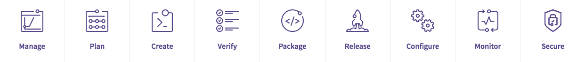

##

## 1. Mô hình tìm hiểu 

## 2.Manage

- Quản lý người dùng và thống kê số liệu trên hệ thống.

- LOG activity , error status 

## 3.Plan

- Trực quan hóa, tăng khả năng phối hữa giữa DEV và OPS ( ticket, issue, report, QA )

## 4.Create, view, and manage code

- Tạo khả năng dễ dàng khởi động, cập nhật ,  xây dựng ứng dụng ngay cả khi đang đặt trên hệ thống /
- Quản lý dự án với khả năng phân nhánh , mở rộng và dễ dàng quản lý nhưng không ảnh hướng tới hệ thống đang vận hành

## 5.Verify

- Có khả năng như một testing system, phát hiện các lỗi sớm, vấn đề về lỗ hổng, kiểm toán chất lượng code, các thành phần yêu cầu  đi kèm khi có một phiên merge mới.

- Sử dụng CI để kiểm soát và phát hiện lỗi nhanh khi các DEV thực hiện commit . Một trong những tuyên ngôn của CI là "Build Software at Every Change".

## 6.Package

- Có khả năng đóng gói các application ( package ), quản lý và quản lý vòng đời dễ dàng. 

- Xâu dựng Docker Registry 

## 7.Release

- Giúp tự động  hóa việc vận hành và phân phối ứng dụng 
- Giảm thiểu thời gian cấu hình và khởi tạo cho sản phẩn ở môi trường Production

- Sử dụng CD để kiểm soát việc build ứng dụng . Continuous Delivery (tạm dịch là chuyển giao liên tục)  bằng cách triển khai tất cả thay đổi về code (đã được build và test) ở CI  đến môi trường testing hoặc staging. 

- Continuous Delivery được thực hiện bằng cách sử dụng Deployment Pipeline.

Deployment Pipeline chia quy trình chuyển giao phần mềm thành các giai đoạn. Mỗi giai đoạn có mục tiêu xác minh chất lượng của các tính năng mới từ một góc độ khác nhau để kiểm định chức năng và tránh lỗi ảnh hưởng đến người dùng. Pipeline sẽ cung cấp phản hồi cho nhóm trong việc cung cấp tính năng mới. Ở góc độ trừu tượng hơn, deployment pipeline là quy trình để chuyển phần mềm từ version control đến tay người dùng. Mỗi thay đổi đến phần mềm sẽ đi qua một quy trình phức tạp để được phát hành.

## 8.Configure

- QUản lý hạ tầng chạy ứng dụng 
- Quản lý , hạn chế việc truy cập vào ứng dụng 

## 9.Monitor

- Kiểm soát ứng dụng, hiển thị các thông số về hiệu năng của hệ thống và ứng dụng đã được realease

## 10.Secure

- Căng độ an toàn cho sản phẩn, chống vượt quyền và tấn công lổ hổng